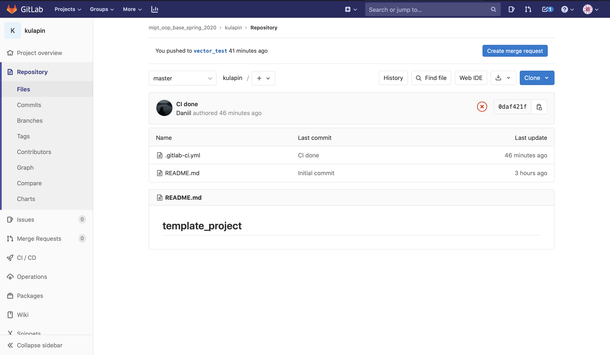
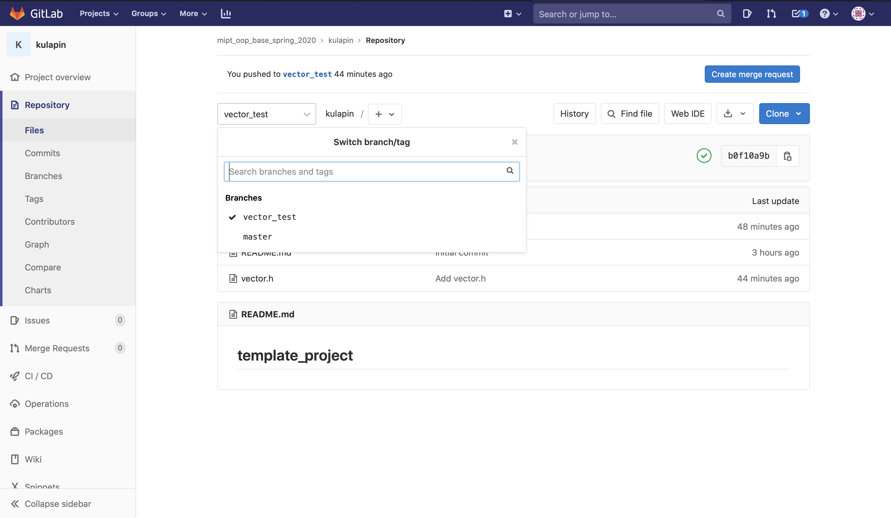
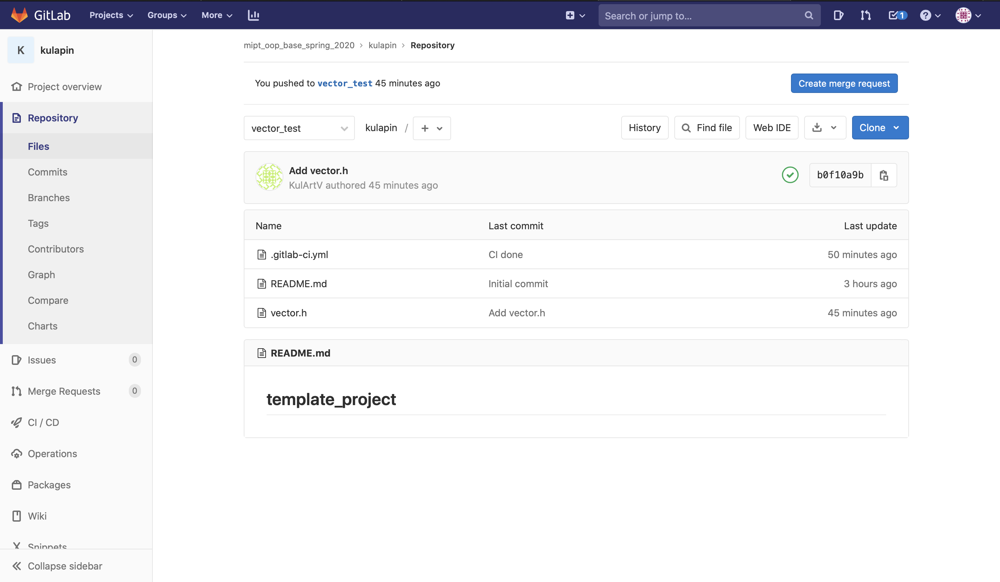
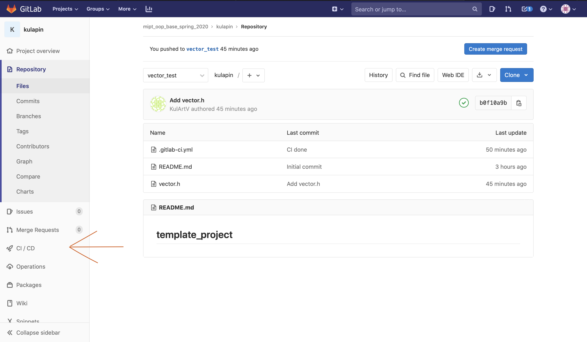
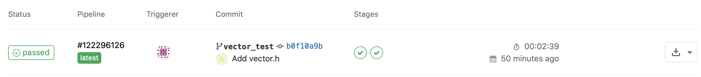
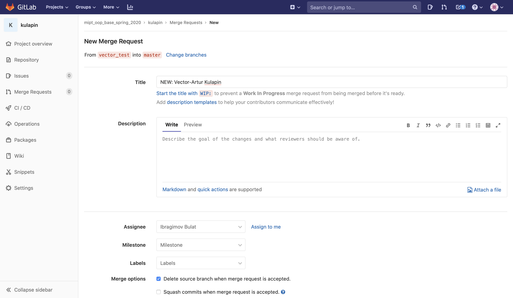

# Репозиторий для тестирования курса ООП

## Как сдавать задачи?

0. Изначально у вас будет такой репозиторий с одной веткой `master`.

1. В репозитории вам необходимо сделать новую ветку с названием, которое вам
   сообщат. Например, для первого задания это будет, скорее всего, `vector_test`.
   В итоге у вас будут в ветке два файла `README.md` и `.gtilab-ci.yml`.

2. В задании вам будет сказано имя класса, который необходимо реализовать.
   Это имя нельзя менять, так как иначе вам не удастся сдать задачу.
   Например, в этой задаче это класс `vector.h`. В итоге в репозитории у вас
   должны быть те же файлы и файл с решением, например, `vector.h` для данной 
   задачи. 
   

   
  
3. После каждого коммита будет запущена специальная программа, которая проверяет 
   ваше решение. Протокол сборки вы сможете найти в разделе `CI/CD` в панели 
   настроек слева.
   

4. Когда вы перейдете в этот раздел и откроете пункт `Pipelines`, вы увидете
   логи всех сборок после каждого коммита. Например, если сборка успешна, то вы 
   должны увидеть вот такую картинку

5. Если вдруг сборка **_Failed_**, то желательно залезть в лог и почитать его. 
   Неуспешная сборка закончится записью **_ERROR: Job failed: exit code N_**, 
   где _N_ - любое ненулевое число. Успешная сборка должна закончиться примерно 
   так

6. Далее вам необходимо создать **Merge Request** из ветки решения в мастера,
   при этом указать в _Assignee_ своего семинариста. Имя _MR_-а стоит называть
   в таком формате **NEW-Название задачи-Фамилия Имя**. Далее вас ждет защита 
   вашего кода **_Good luck, have fun_**.

   
   
## Как это все работает?

При каждом новом коммите `.gtilab-ci.yml` запускает новую сборку проекта и 
тестирует ваш файл, подключая его к файлам с тестами. Все это автоматически 
собирается с помощью системы _Gitlab-CI_, о которой вы скоро будете говорить на 
курсе Технологий Программирования. По итогу вы видите логи тестирования, которое
осуществляется с помощью _Google tests_ (о них вы тоже услышите на том же курсе).

### P.S. 
Не отчаивайтесь, если это кажется сложным. Это скорее хорошее упражнение
для вас, чем наказание. Не бойтесь писать семинаристам или однокурсникам, если 
возникают вопросы по работе системы. **_Google will help you!_** 
